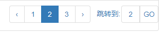

# Table Page Jump

## Usage

```html
<link rel="stylesheet" href="extensions/page-jump/bootstrap-table-pagejump.css"></style>
<script src="extensions/page-jump/bootstrap-table-pagejump.js"></script>
```

## Options

### paginationShowPageGo

* type: Boolean
* description: Set true to enable show 'Page Jump'. 
* default: `false`

## Language

```
<script src="src/locale/bootstrap-table-zh-CN.js"></script>
```

## ex




*注：*
> 部分代码参考了以下文章：

[文章链接](http://blog.csdn.net/lhtzbj12/article/details/77170489)